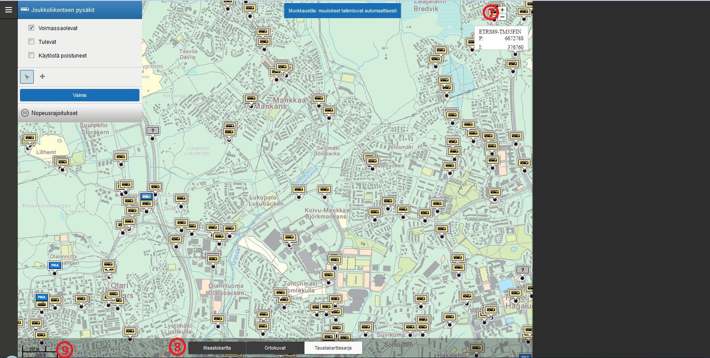
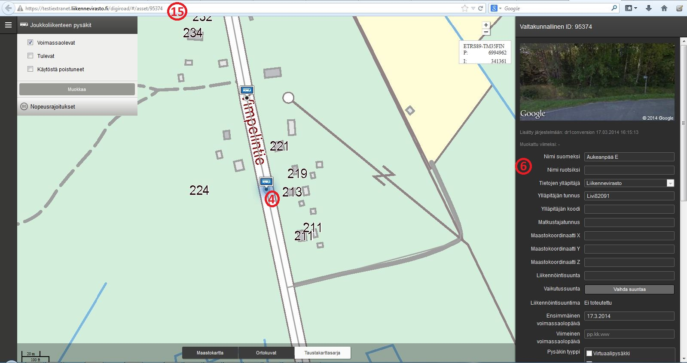
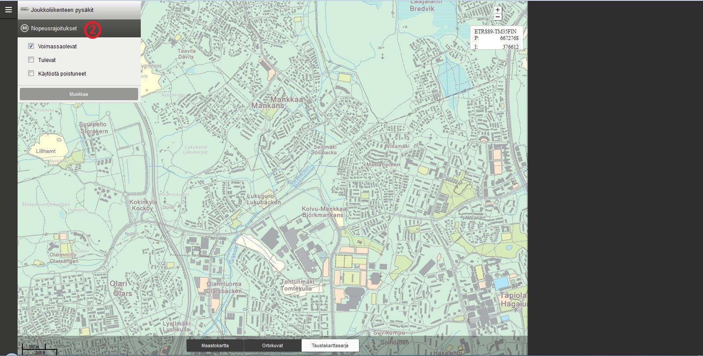
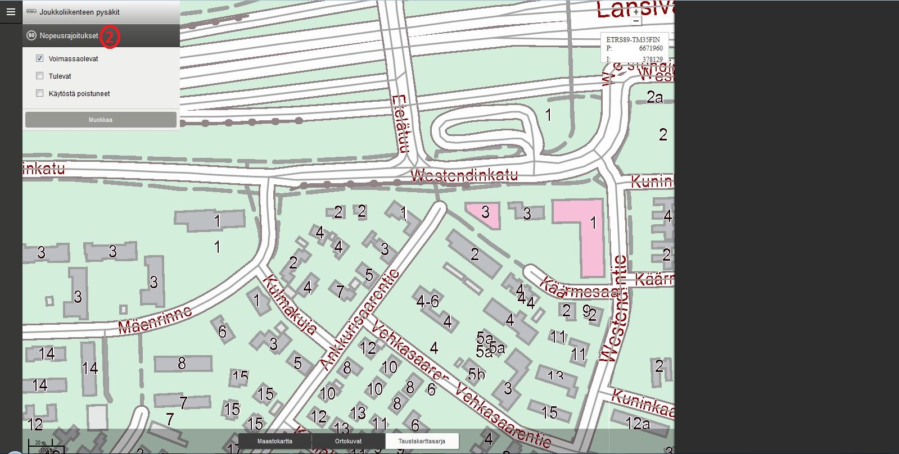
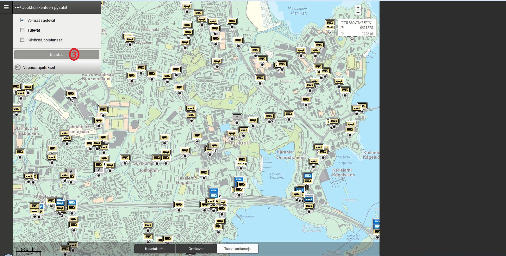
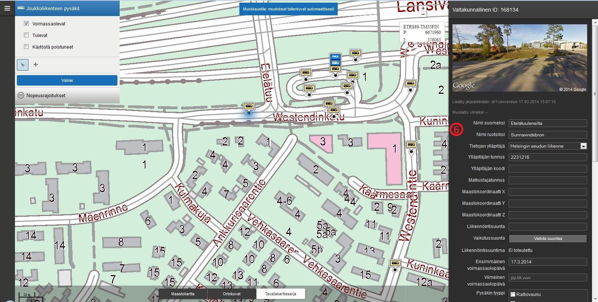
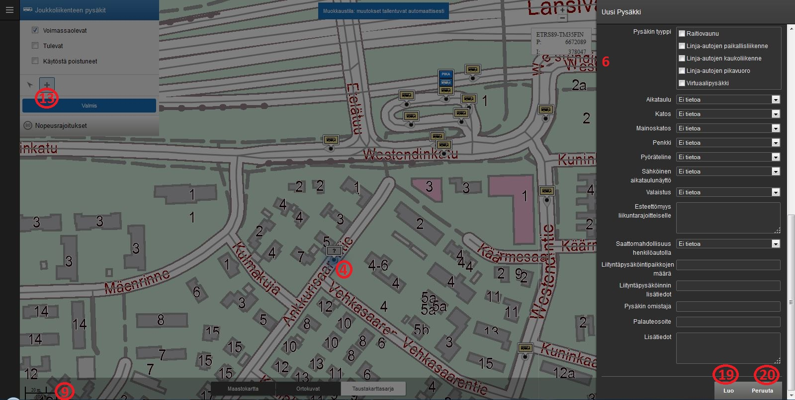
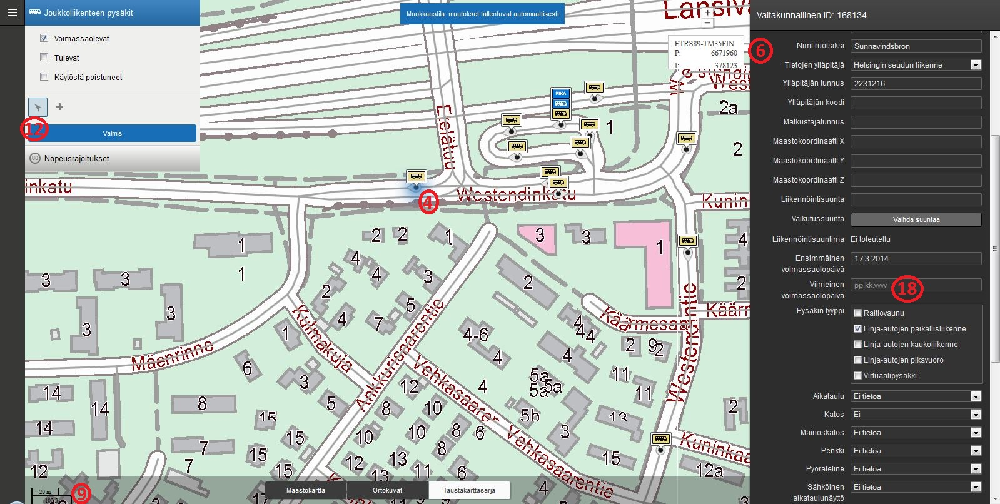

__DIGIROAD-SOVELLUKSEN KÄYTTÖOHJE__
===================================

Selitteet
---------

###Katselutila###

_Katselutila._

1. Pysäkit -paletti			
1. Nopeusrajoitukset -paletti		
1. “Muokkaa”-painike            	
1. Valittu pysäkki
1. Google Street View      	
1. Ominaisuustieto -näkymä        	
1. Mittakaavapainike
1. Taustakartat            	
1. Mittakaava                		
1. Pisara

###Muokkaustila###

_Muokkaustila._

11.“Valmis”-painike        	
12.Muokkaustyökalu        
13.Lisäystyökalu        
14.Muokkaustilan tunnusteksti

1. Miten päästä alkuun?
-----------------------

1. Digiroadiin käyvät olemassa olevat Liikenneviraston tunnukset. Mikäli tunnuksia ei ole, ne saa Digiroad -palvelusta: info@digiroad.fi tai 040-507 2301.

1. Digiroad-selainsovellukseen kirjaudutaan osoitteessa: https://testiextranet.liikennevirasto.fi/digiroad/.  

1. Kirjautumisen jälkeen avautuu karttakäyttöliittymässä katselutila alueelta, johon käyttäjällä on päivitysoikeudet. Päivitysoikeudet on toistaiseksi rajattu ainoastaan maantieteellisesti. 

Päivitysoikeudet jakautuvat seuraavasti:

- Kuntakäyttäjällä on oikeudet oman kunnan maantieteellisen kuntarajan sisäpuolella oleviin aineistoihin.
- ELY-käyttäjällä on oikeudet oman ELY-alueensa maantieteellisen rajan sisäpuolella oleviin aineistoihin.
- DR-operaattorilla on oikeudet koko Suomen aineistoihin.

Jos kirjautumisen jälkeen ei avaudu karttakäyttöliittymän katselutilaa, ei kirjautuneelle henkilölle ole luotu Digiroad-oikeuksia. Tällöin tulee ottaa yhteyttä Digiroad-palveluun: info@digiroad.fi tai 040-507 2301.

1.1 Mistä saada opastusta?
--------------------------

Digiroad-palvelusta saa tarvittavia tunnuksia ja käyttöoikeuksia selainsovellukseen. Palvelu auttaa myös ongelmatilanteissa sovelluksen käytön kanssa.

Yhteystiedot:

Digiroad-palvelu:
info@digiroad.fi 
p. 040-507 2301

Pysäkkeihin liittyvät asiat:
pysakit@digiroad.fi 

2. Kirjautuminen Digiroad-sovellukseen
--------------------------------------

Digiroad-selainsovellukseen kirjaudutaan osoitteessa: https://testiextranet.liikennevirasto.fi/digiroad/. Kirjautumiseen tarvitaan voimassa olevat Liikenneviraston tunnukset. Tunnuksia saa Digiroad-palvelusta (kts. s.5).

_Kirjautuminen Digiroadiin._

Kirjautumisen jälkeen avautuu Digiroad-selainsovelluksen karttakäyttöliittymän katselutila. Maantieteellisesti kartalla on näkyvissä alue, johon käyttäjällä on päivitysoikeudet (kts. s.5).

_Karttakäyttöliittymän katselutila._

Mikäli kirjautumisen jälkeen ei avaudu karttakäyttöliittymän katselutilaa, ei käyttäjällä ole oikeuksia Digiroad-sovellukseen. Digiroad-oikeuksia voi pyytää digiroad-palvelusta (kts. s.5).

3. Yleistä
----------

Sovelluksella on kaksi tilaa: katselu- ja muokkaustila. Kirjautumisen jälkeen avautuu katselutila, jossa voi ainoastaan katsella eri tietolajeja, esimerkiksi pysäkkejä tai nopeusrajoituksia. Tietolajien muokkaus suoritetaan muokkaustilassa. Molemmissa tiloissa näkyvät ainoastaan ne tietolajit, joihin käyttäjällä on päivitysoikeudet (kts. s.5). Kartalle voi valita yhden tietolajin kerrallaan, esimerkiksi pysäkit. Tietolaji valitaan sivun vasemman laidan valikosta.

Muokkaustilan saa aktivoitua klikkaamalla “Muokkaa”-painiketta (3). Muokkaustilassa kartan yläosassa on teksti “Muokkaustila: muutokset tallentuvat automaattisesti” (14). Muokkaustilassa kaikki tehdyt muutokset tallentuvat automaattisesti. Takaisin katselutilaan pääsee klikkaamalla “Valmis”-painiketta (11).

_Katselutila._

_Muokkaustila._

3.1 Karttanäkymän muokkaus
--------------------------

####Kartan liikutus####

Karttaa liikutetaan raahaamalla tai nuolinäppäimillä.

####Mittakaavataso####

Kartan mittakaavatasoa muutetaan joko hiiren rullalla, tuplaklikkaamalla, Shift+piirto (alue) tai mittakaavapainikkeista  (7). Käytössä oleva mittakaavataso näkyy kartan vasemmassa alakulmassa (9).

####Muita toimintoja####

Taustakartaksi voi valita maastokartan, ortokuvat tai taustakarttasarjan. (8) 

_Karttanäkymän muokkaus._

3.2 Joukkoliikenteen pysäkkien valinta
--------------------------------------

Karttanäkymään voi valita pysäkkejä klikkaamalla “Joukkoliikenteen pysäkit”-painiketta (1). Pysäkkejä valitaan pysäkin voimassaolon mukaan: voimassa olevat, tulevat ja/tai käytöstä poistuneet. Valitseminen toimii samalla tavalla sekä katselu- että muokkaustilassa. Joukkoliikenteen pysäkit -paletti sulkeutuu painamalla vasemmassa yläkulmassa olevaa kuvaketta.

Joukkoliikenteen pysäkit näkyvät vain tarpeeksi tarkalla mittakaavatasolla, joka on  1:20 000 tai tarkempi (9). Sovellus ilmoittaa, kun mittakaavataso on liian epätarkka pysäkkien näkymiselle. Mittakaavataso pysäkkien näkymiselle on sama sekä katselu- että muokkaustilassa.

_Joukkoliikenteen pysäkkien valinta._

####Joukkoliikenteen pysäkkien haku####

Joukkoliikenteen pysäkkejä haetaan pysäkin kansallisella ID:llä yksilöidyllä URL-osoitteella. Esimerkki URL-osoitteesta:

https://testiextranet.liikennevirasto.fi/digiroad/#/asset/95374  (15)

missä numerosarja 95374 on pysäkin kansallinen ID. Toiminto tarkentaa karttakäyttöliittymän katselutilan haetun pysäkin kohdalle. Pysäkki saa sinisen korostusvärin (4) ja sen ominaisuustietonäkymä (6) aukeaa sivun oikealle puolelle.

_Joukkoliikenteen pysäkkien haku._

3.3 Nopeusrajoitusten valinta
-----------------------------

Karttanäkymään voi valita nopeusrajoitukset klikkaamalla “Nopeusrajoitukset”-painiketta (2).

_Nopeusrajoitusten valinta._

4. Katselutila
--------------

Katselutila on sovelluksen tietolajien katselemista varten. Katselutilassa ei voi muokata tietolajeja. 

4.1 Pysäkin tietojen katselu
----------------------------

Pysäkit tulevat näkyviin, kun kartan mittakaavataso on 1:20 000 tai tarkempi (9). Yksittäisen pysäkin ominaisuustiedot tulevat näkyviin, kun pysäkkiä klikataan. Tällöin sivun oikeaan laitaan avautuu Google Street View (5) ja ominaisuustieto -näkymä (6). Valitulla pysäkillä on sininen korostusväri (4).

Ominaisuustieto -näkymässä kaikki kentät ovat disabloituja eli niitä ei voi muokata. Google Street View -kuvaa klikkaamalla avautuu Google Street View uudelle välilehdelle. 

_Joukkoliikenteen pysäkin tietojen katselu._

4.2 Nopeusrajoitusten tietojen katselu
--------------------------------------

Nopeusrajoituksia voi katsella valitsemalla nopeusrajoitukset "Nopeusrajoitus"-painikkeella kartalle. (2)

_Nopeusrajoitusten tietojen katselu._

5. Muokkaustila
---------------

Muokkaustila aktivoidaan painamalla “Muokkaa”-painiketta (3). Muokkaustila on eri tietolajien muokkaamista varten ja se on ulkoasultaan erilainen kuin katselutila. Kartan yläosassa on teksti:”Muokkaustila: muutokset tallentuvat automaattisesti”.  

Muokkaustilassa kaikki muutokset tallentuvat automattisesti heti niiden tekemisen jälkeen. Muokkaustilasta pääsee katselutilaan klikkaamalla “Valmis”-painiketta (11).

_Muokkaustilaan pääsee klikkaamalla “Muokkaa”-painiketta (3)._

_Muokkaustilasta pääsee pois klikkaamalla “Valmis”-painiketta (11)._

5.1 Joukkoliikenteen pysäkit
----------------------------

Joukkoliikenteen pysäkit ovat julkisen liikenteen käytössä olevia pysäkkejä: linja-autojen paikallisliikenteen, linja-autojen kaukoliikenteen, linja-autojen pikavuorojen ja raitiovaunujen pysäkit sekä virtuaalipysäkit. 

5.1.1 Joukkoliikenteen pysäkin ominaisuustietojen muokkaus
--------------------------------------------------------
Yksittäisen pysäkin ominaisuustietoja voi muokata valitsemalla muokkaustyökalun (12). Muokattava pysäkki valitaan hiirellä klikkaamalla. Pysäkkiä valittaessa kartan mittakaavatason täytyy olla 1:20 000 tai tarkempi, jotta pysäkin ominaisuustietojen muokkaaminen on mahdollista (9). Sovellus ilmoittaa, kun mittakaavataso on liian epätarkka pysäkkien muokkaamista varten.

Valittu pysäkki näkyy sinisellä korostusvärillä (4). Sivun oikeaan laitaan avautuu Google Street View -näkymä (5) pysäkistä sekä pysäkin ominaisuustiedot (6). 

_Joukkoliikenteen pysäkin ominaisuustietojen muokkaus._

####Pysäkin vaikutussuunnan muuttaminen####

Googlen Street View -näkymä (5) sivun oikeassa laidassa on suunnattu suuntaan, jossa pysäkin tallennetun vaikutussuunnan mukaan kuuluisi olla. Painamalla näkymää avautuu Googlen Street View -välilehti, jossa pysäkin ympäristöä voi tarkastella tarkemmin. Kartalla pysäkin vaikutussuunta näkyy pisarana pysäkkikuvakkeella (10). Pisaran kärki osoittaa pysäkin liikennevirran suuntaan.

Pysäkin vaikutussuunnan voi muuttaa ominaisuustietonäkymässä (6) painamalla “Vaihda suuntaa”-painiketta (16). Pysäkin vaikutussuuntaa muutettaessa Googlen Street View -näkymä (5) muuttuu vastaamaan uutta vaikutussuuntaa ja pisaran suunta kääntyy.

_Joukkoliikenteen pysäkin vaikutussuunnan voi muuttaa painamalla “Vaihda suuntaa”-painiketta (16)._

####Pysäkin voimassaolopäivien muokkaus####

Ensimmäinen voimassaolopäivä (17) tarkoittaa päivämäärää, josta lähtien pysäkki on käytössä. Viimeinen voimassaolopäivä (18) tarkoittaa päivämäärää, jolloin pysäkki on viimeisen kerran käytössä. Molempia päivämääriä voi muokata ominaisuustieto -näkymän (6) kautta. Päivämääriä voi muokata joko kirjoittamalla ne päivämääräkenttään muodossa pp.kk.vvvv tai valitsemalla ne kalenterista, joka avautuu, kun päivämääräkenttää klikkaa.

Päivämääriä ei voi asettaa ristiin siten, että “Ensimmäinen voimassaolopäivä” olisi myöhemmin kuin “Viimeinen voimassaolopäivä”. Kalenterissa ei-sallitut päivämäärät ovat disabloituja. Jos päivämääräkenttään kirjoittaa päivämäärän, joka asettaa päivämäärät ristiin, ei päivämäärä tallennu.

Jos “Ensimmäinen voimassaolopäivä” tai “Viimeinen voimassaolopäivä” ei ole tiedossa, voi kalenterista valita “ei tietoa”.

_Pysäkin voimassaolopäivien muokkaus._

####Pysäkin muiden ominaisuustietojen muokkaus####

Muita ominaisuustietoja voi muokata oikeassa laidassa olevan ominaisuustietonäkymän (5) kautta. Tietoja muokataan joko kirjoittamalla tietokenttään, valitsemalla pudotusvalikosta tieto tai merkitsemällä rasti ruutuun oikean/oikeiden tietojen kohdalle.

_Joukkoliikenteen pysäkin ominaisuustietojen muokkaus._

####Ominaisuustiedot:####

__Nimi suomeksi:__ Pysäkin nimi suomen kielellä.
__Nimi ruotsiksi:__ Pysäkin nimi ruotsin kielellä.
__Tietojen ylläpitäjä:__ Kunta, Helsingin seudun liikenne, ELY-keskus tai Liikennevirasto.
__Ylläpitäjän tunnus:__ Tietojen ylläpitäjän sisäinen tunnus pysäkille.
__Ylläpitäjän koodi:__ Pysäkin omistajan sisäinen tunnus pysäkille.
__Matkustajatunnus:__ Pysäkin tunnus, joka näkyy matkustajalle.
__Maastokoordinaatti X:__ Pysäkin sijainnin mitattu X-koordinaatti.
__Maastokoordinaatti Y:__ Pysäkin sijainnin mitattu Y-koordinaatti.
__Maastokoordinaatti Z:__ Pysäkin sijainnin mitattu Z-koordinaatti.
__Liikennöintisuunta:__ Pysäkin suunta sanallisesti kuvattuna. Esimerkiksi:”Keskustaan”.
__Vaikutussuunta:__ Vaikutussuunta on visualisoitu pysäkin liikennevirran suunnaksi pisaralla (9). Google Street View (4) osoittaa suuntaan, jossa pysäkin kuuluisi olla.
__Liikennöintisuuntima:__ Ei toteutettu
__Ensimmäinen voimassaolopäivä:__ Päivämäärä, jolloin pysäkki on ensimmäisten kerran käytössä. 
__Viimeinen voimassaolopäivä:__ Päivämäärä, jolloin pysäkki on viimeisen kerran käytössä.
__Pysäkin tyyppi:__ Linja-autojen paikallisliikenne, raitiovaunu, linja-autojen kaukoliikenne, linja-autojen pikavuoro, virtuaalipysäkki tai “ei tietoa”.
__Aikataulu:__ Kyllä, ei tai ei tietoa. Oletuksena on “ei tietoa”.
__Katos:__ Kyllä, ei tai ei tietoa. Oletuksena on “ei tietoa”.
__Mainoskatos:__ Kyllä, ei tai ei tietoa. Oletuksena on “ei tietoa”.
__Penkki:__ Kyllä, ei tai ei tietoa. Oletuksena on “ei tietoa”.
__Pyöräteline:__ Kyllä, ei tai ei tietoa. Oletuksena on “ei tietoa”.
__Sähköinen aikataulunäyttö:__ Kyllä, ei tai ei tietoa. Oletuksena on “ei tietoa”.
__Valaistus:__ Kyllä, ei tai ei tietoa. Oletuksena on “ei tietoa”.
__Esteettömyys liikuntarajoitteiselle:__ Liikuntarajoitteisen henkilön pääsy pysäkille. Esimerkiksi:“Matala reunakivi, pääsy pyörätuolilla”. Oletuksena on “ei tiedossa”.
__Saattomahdollisuus henkilöautolla:__ Kyllä, ei tai ei tietoa. Oletuksena on “ei tietoa”.
__Liityntäpysäköintipaikkojen määrä:__ Pysäkin yhteydessä olevien liityntäpysäköintipaikkojen määrä.
__Pysäkin omistaja:__ Kunta, Helsingin seudun liikenne, ELY-keskus tai Liikennevirasto.
__Palauteosoite:__ Osoite, johon pysäkistä voi laittaa palautetta. Esimerkiksi sähköpostiosoite.
__Lisätiedot:__ Julkiset kommentit. Esimerkiksi: “Alueella tietöitä”.

5.1.2 Pysäkin siirtäminen
-----------------------

Pysäkkiä siirretään käyttämällä muokkaustyökalua (12). Pysäkkejä voi siirtää vain tarpeeksi tarkalta mittakaavatasolta, joka on 1:10 000 tai tarkempi (9). 

Siirtäminen tapahtuu tarttumalla pysäkkiin kiinni ja raahaamalla se oikeaan paikkaan. Virheellisten siirtojen estämiseksi pysäkki lähtee liikkumaan 0,3 sekunnin kuluttua siitä, kun pysäkistä on tarrattu kiinni. Pysäkki liikkuu vain olemassa olevia tielinkkejä pitkin ja käyttäjän päivitysoikeuksien sallimien maantieteellisten rajojen sisäpuolella. Jos pysäkin irrottaa tielinkistä, kiinnittyy se automaattisesti lähimpään tielinkkiin, joka on käyttäjän päivitysoikeuksien sallimalla maantietellisellä alueella. Jos riittävän lähellä  ei ole toista tielinkkiä, ei pysäkki irtoa linkiltä, jolla se on. Tielinkki, jonka päällä pysäkki on, näkyy sinisellä korostusvärillä. Kun pysäkistä päästetään irti (lasketaan se uuteen sijaintiin), korostuu siirretty pysäkki sinisellä korostusvärillä (4) ja oikealle avautuu Google Street View (5) ja ominaisuustieto -näkymä (6), jonka kautta voi halutessaan muokata muita ominaisuustietoja. Pysäkin siirtäminen ei muuta pysäkin mitattuja maastokoordinaatteja vaan ne säilyvät ennallaan.

_Joukkoliikenteen pysäkin siirtäminen._

5.1.3 Uuden pysäkin lisääminen
----------------------------

Uusia pysäkkejä voi lisätä, kun mittakaavataso on 1:10 000 (9) tai tarkempi. Uusi pysäkki luodaan klikkaamalla kartan tiestöstä haluttu sijainti pysäkille lisäystyökalulla (13). Jos valitulla kohdalla ei ole tielinkkiä, muodostuu pysäkki lähimmälle tielinkille. Jos pysäkin yrittää luoda liian kauas lähimmästä tielinkistä, ei pysäkkiä muodostu. Uusi pysäkki on korostettu sinisellä värillä (4) ja sivun oikealle puolelle avautuu Google Street View (5) ja ominaisuustietonäkymä (6), jossa pysäkille tallennetaan tiedossa olevat ominaisuustiedot. 

Sovellus muodostaa osan ominaisuustiedoista itse, jos niitä ei määritetä. “Ensimmäinen voimassaolopäivä” oletetaan meneillään olevaksi päivämääräksi. Pysäkin vaikutussuunta oletetaan alla olevan linkin digitointisuunnaksi. Ylläpitäjä oletetaan kunnaksi. Pysäkin tyypiksi asetetaan “ei tietoa”. Kaikkien varusteiden oletusarvo on “ei”. Lisäksi valtakunnallinen tunnus muodostuu automaattisesti Digiroadin omasta numeroavaruudesta eikä käyttäjän tarvitse sitä itse asettaa. 

Kun ominaisuustiedot on kirjattu, painetaan “Luo” -painiketta (19) tietojen tallentamiseksi tietokantaan. Jos pysäkkiä ei halutakaan luoda, painetaan “Peruuta” -painiketta (20). Sovellus antaa muokata vain luotavan pysäkin ominaisuustietoja niin kauan, kunnes on klikattu joko “Luo” tai “Peruuta”.

Uuden pysäkin lisäämisen vaiheet:

1. Aktivoi muokkaustila.
1. Etsi kartalta kohta, jonne haluat pysäkin lisätä.
1. Tarkenna mittakaava 1:10 000 tai tarkemmaksi (9).
1. Valitse lisäystyökalu (13).
1. Klikkaa linkin kohtaa, johon haluat lisätä pysäkin.
1. Lisää ominaisuustieto -näkymään (6) olemassa olevat tiedot pysäkistä.
1. Jos et haluakaan luoda ko. pysäkkiä, paina “Peruuta” -painiketta (20).
1. Kun olet lisännyt haluamasi tiedot, paina “Luo” -painiketta (19).

_Joukkoliikenteen pysäkin siirtäminen._

5.1.4 Vanhan pysäkin poistaminen
------------------------------

Olemassa oleva pysäkki poistetaan muokkaustyökalulla (12). Kartan mittakaavan tulee olla 1:20 000 tai tarkempi, jotta pysäkkejä voi poistaa (9). Poistettava pysäkki valitaan klikkaamalla pysäkkikuvaketta, jolloin avautuu ominaisuustietonäkymä (6). Valittu pysäkki korostuu sinisellä huomiovärillä (4). Poisto suoritetaan asettamalla ominaisuustietonäkymän (6) “Viimeinen voimassaolopäivä” -kenttään (18) pysäkin viimeinen voimassaolopäivämäärä. Pysäkin tila muuttuu käytöstä poistuneeksi viimeistä voimassaolopäivämäärää seuraavana päivänä. Pysäkin poistamisen voi perua valitsemalla “Viimeinen voimassaolopäivä” -kenttään “Ei tietoa” avautuvasta kalenterista tai pyyhkimällä kentän tyhjäksi.

Jos pysäkin viimeinen voimassaolopäivä on menneisyydessä, aktivoituu kartalla “Käytöstä poistuneet” -pysäkkivalinta. Pysäkin kuvake häviää kartalta, kun “Käytöstä poistuneet” -pysäkkivalinnan sulkee.

Vanhan pysäkin poistamisen vaiheet:

1. Aktivoi muokkaustila. 
1. Etsi kartalta pysäkki, jonka haluat poistaa.
1. Tarkenna kartan mittakaava 1:20 000 tai tarkemmaksi (9).
1. Valitse muokkaustyökalu (12).
1. Klikkaa pysäkkiä (4).
1. Aseta pysäkille “Viimeinen voimassaolopäivä” -kenttään (18) viimeinen voimassaolopäivämäärä kirjoittamalla tai valitsemalla se kalenterista, joka avautuu klikkaamalla “Viimeinen voimassaolopäivä” -kenttää.
1. Jos et halua poistaa pysäkkiä, valitse kalenterista “Ei tietoa”.
1. Pysäkin viimeinen voimassaolopäivämäärä tallentuu automaattisesti.

_Joukkoliikenteen pysäkin poistaminen._

5.2 Nopeusrajoitukset
---------------------